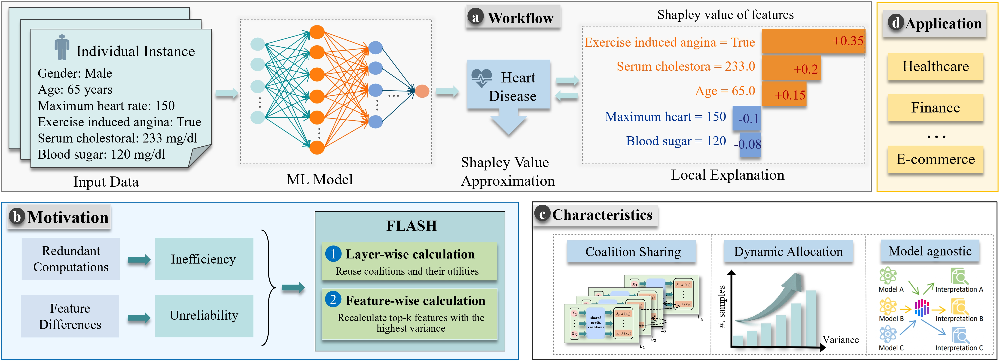
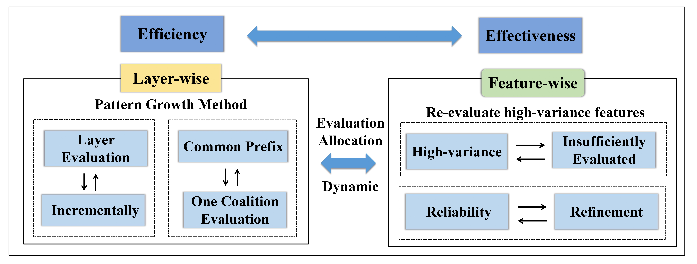

# FLASH: A Fast and Reliable Shapley Value Approximation Framework for Model-Agnostic Interpretation

This repository contains the code for the paper "FLASH: A Fast and Reliable Shapley Value Approximation Framework for Model-Agnostic Interpretation".


## FLASH Overview

FLASH is a framework supporting model-agnostic interpretation via fast and reliable Shapley value approximation. It employs a two-phase evaluation process: first, a layer-wise evaluation to generate unique coalitions in a pattern growth manner, followed by a feature-wise evaluation that focuses on the top-𝑘 features with the highest variances. FLASH also dynamically allocates the number of evaluations, ensuring a more efficient and reliable Shapley value approximation.

## Features
- Model-agnostic 
- Local interpretation
- Dynamic Allocation

  
## Implementation
1. Prerequisites
- Java Development Kit (JDK) version 8 or higher
- An IDE (e.g., IntelliJ IDEA, Eclipse) or a text editor (e.g., VS Code)
  
2. Clone the Repository
   To get a local copy of this repository, run the following command:
    ```bash
    git clone https://anonymous.4open.science/r/FLASH-7088/

3. Compile and Run
- Navigate to the project directory:
  ```bash
   cd repository
- Compile the Java files
   ```java
   javac Main.java
- Run the application
  ```bash
  java Main
  

## Baseline Setup
- MC: The Monte Carlo method (MC) approximates the Shapley value by randomly sampling permutations of features. In the experiments, MC serves as a benchmark for approximating the Shapley value.
- CC: It reformulates Shapley value estimation by using complementary contributions, measuring the utility difference between a coalition and its complement. <[CC-Method](https://github.com/ZJU-DIVER/ShapleyValueApproximation)>
- CCN: Building on the CC method, CCN optimizes the sampling process using Neyman allocation. <[CCN-Method](https://github.com/ZJU-DIVER/ShapleyValueApproximation)>
- S-SVARM: It is designed to approximate the Shapley value by sampling coalitions without relying on marginal contributions. <[S-SVARM method](https://github.com//kolpaczki//Approximating-the-Shapley-Value-without-Marginal-Contributions)>
  

## Repository Structure
### Folders
- Compared_algorithm: the 
- Game:
- Global: 
- Structure: Maintain the data structures for FLASH. 

### Files
- main.java: All algorithms are implemented in 'main.java'
- Game/GameClass.java: The global initialization and experimental setup.
- Global/Info.java: All settings related to determinism.
